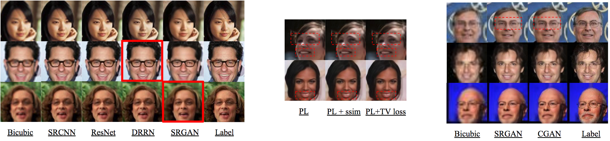
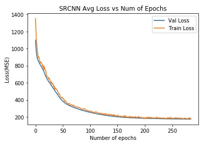
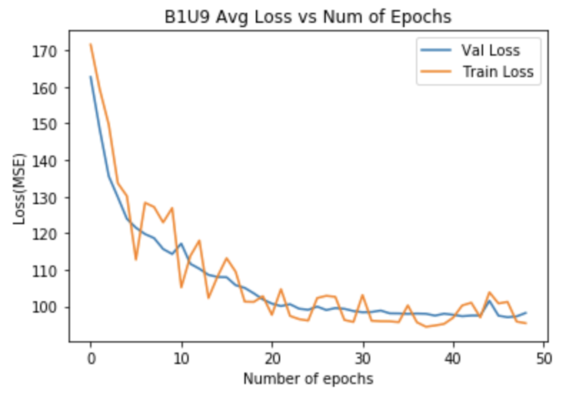
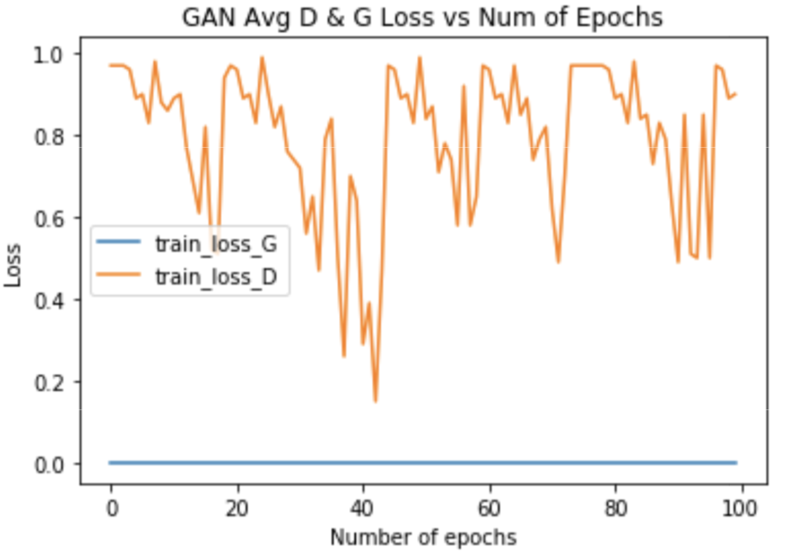
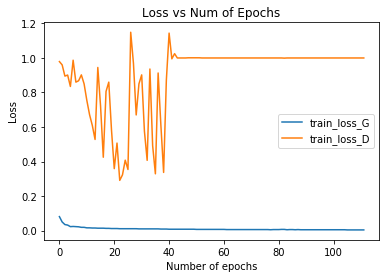

# Super Resolution with CNNs and GANs

This is the code for our cs231n project.

**[Super Resolution with CNNs and GANs](https://github.com/yiyang7/cs231n_proj)**,
<br>
[Yiyang Li](https://github.com/yiyang7),
[Yilun Xu](https://github.com/Beehamer),
[Ji Yu](https://github.com/NaruSaku)
<br>

We investigated the problem of image super-resolution (SR), where we want to reconstruct high-resolution images from low-resolution images. We presented a residual learning framework to ease the training of the substantially deep network. Specifically, we reformulated the structure of the deep-recursive neural network to improve its performance. To further improve image qualities, we built a super-resolution generative adversarial network (SRGAN) framework, where we proposed several loss functions based on perceptual loss, i.e. SSIM loss and/ or total variation (TV) loss, to enhance the structural integrity of generative images. Moreover, a condition is injected to resolve the problem of partial information loss associated with GANs. 

The results show that our methods and trails can achieve equivalent performance on most of the benchmarks compared with the previous state-of-art methods, and out-perform them in terms of the structural similarity. Here are a few example outputs:



If you find this code useful in your project, please star this repository and cite:

```
@inproceedings{densecap,
  title={Super Resolution with CNNs and GANs},
  author={Yiyang, Li and Yilun, Xu and Ji, Yu},
  year=2018,
}
```

## Installation
This project was implemented in [PyTorch 0.4](https://pytorch.org/#pip-install-pytorch) and [Python3](https://www.python.org/downloads/)

## Quickstart
1. __Build datasets__: First, you need to download the dataset. We use [CelebA](http://mmlab.ie.cuhk.edu.hk/projects/CelebA.html) as our dataset.
e.g for cnn_based model, we set input size 144×144 and output size 144×144; For gan model, we set input size 36×36 and output size 144×144
```
python build_dataset.py --data_dir ../img_align_celeba_test --output_dir ../data/cnn_faces --input_size 144 --output_size 144
```

2. __Train your experiment__

for cnn-based models, e.g SRCNN:
```
python train_cnn.py --data_dir ../data/cnn_faces --model_dir experiments/srcnn_model --model srcnn --cuda cuda0 --optim adam
```
for gan models, e.g SRGAN:
```
python train_gan.py --data_dir ../data/gan_faces --model_dir experiments/gan_model --model gan --cuda cuda0 --optim adam
```
If you want to train the model from last time, add this:
```
--restore_file "best"
```

3. __Perform hyperparameters search__ e.g srcnn from cnn_based model

```
python search_hyperparams.py --data_dir ../data/cnn_faces --parent_dir experiments/learning_rate --model srcnn --model_type cnn
```

4. __Display the results__ of the hyperparameters search in a nice format
```
python synthesize_results.py --parent_dir experiments/learning_rate
```

5. __Evaluation on the test set__

for cnn-based models, e.g SRCNN:
```
python evaluate_cnn.py --data_dir ../data/cnn_faces --model_dir experiments/srcnn_model --model srcnn --cuda cuda0
```
for gan models, e.g SRGAN:
```
python evaluate_gan.py --data_dir ../data/gan_faces --model_dir experiments/gan_model --model gan --cuda cuda0
```

<!--## Guidelines for more advanced use-->
<!--1. __save output of test images__-->
<!--2. __save feature maps__ -->

## Result List
1. __SRCNN__


2. __DRRN__


3. __SRGAN__


4. __CGAN__


## Pre-trained Models
The following Pytorch models were trained on CelebA dataset:
1. SRCNN([best.pth.tar](https://www.dropbox.com/sh/n67zyn286lhi7jf/AABUi_X5ZIqiZ2cYMEnU2_iba?dl=0))
2. DRRN([best.pth.tar](https://www.dropbox.com/sh/rcwwu5pjaqs8d5h/AADlhENVfVTaorRmJ5oE8PFna?dl=0))
3. SRGAN([best.pth.tar](https://www.dropbox.com/sh/rt36dv65gkhu31z/AAAIR3M15km9VTF6vY9wIh8Ea?dl=0))
4. CGAN([best.pth.tar](https://www.dropbox.com/sh/z2yjowd2mpg2ojc/AABINIMAfyM7rjvymookPI-ra?dl=0))

## Reference
[1] CS230 Stanford, https://github.com/cs230-stanford/, cs230-code-examples, 2018.

[2] tyshiwo, Drrn CVPR17, https://github.com/tyshiwo/DRRN_CVPR17, 2017.

[3] leftthomas, Srgan, https://github.com/leftthomas/SRGAN, 2017.

[4] znxlwm, pytorch-generative-modelcollections, https://github.com/znxlwm/pytorch-generative-model-collections, 2017.

